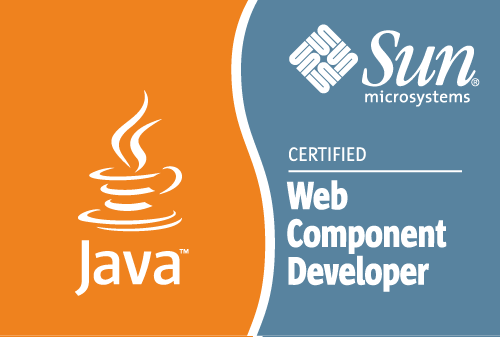
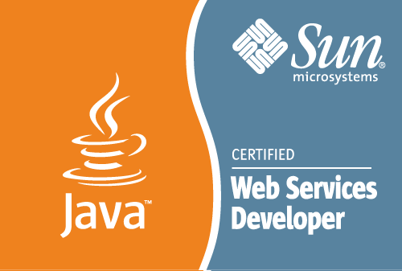
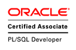
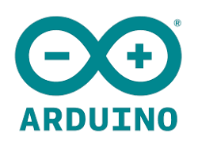

## Welcome

I'm Pasquale Pizzuti, and this is my profile page where I share information about my job, my skills, my projects, my ideas and much more!

### Projects and skills

I work as a Software Developer Engineer in a small company based in Battipaglia, Italy. Since my first projects at university (about since 2005), I have been working with the **Java language** accumulating substantial expertise over the years. My projects primarily involve **web-based applications**, and I also possess skills in related languages such as SQL, XML, SOAP, JSON, Javascript, HTTP, HTML, CSS, etc.

My preferred Operating System is **Linux** that is more flexible for programmers but also maintain solid experience with Windows environments. Recently, I've been specializing in using the **Raspberry Pi** system (headless) to support home automation, particularly with applications like [OpenHAB](https://www.openhab.org/), [Pi-Hole](https://pi-hole.net/), [RetroPie](https://retropie.org.uk/), [Kodi](https://kodi.tv/), etc.

In the realm of home automation, I am proficient in building small **LAN networks** and have acquired skills in creating simple circuits based on the [ESP32](https://www.espressif.com/en/products/socs/esp32) microcontroller unit, programmed through the Arduino platform.

I am passionate about photography and am actively working to improve my skills in photo editing.

For other activities, visit [my GitHub page](https://github.com/paspiz85).

### A Brief History

I was born on 8th February 1985 and studied **computer science** at the [Università degli Studi di Salerno](https://www.unisa.it/), where I graduated in 2007.

After obtaining bachelor's degree, I continued my studies. In 2008 I began working in a small company based in Rome, Italy. However, after several years (and numerous exams), I decided to suspend my master's degree to fully dedicate myselft to work.

The main companies where I have worked are [Inmatica](https://www.inmatica.com/), [Almaviva](https://www.almaviva.it/), [ObjectWay](https://www.objectway.com/), [Altran](http://www.altran.com/), [Venere.com](http://www.venere.com/), [Hotels.com](https://www.hotels.com) and currently [Infotel Sistemi](https://www.infotelsistemi.com/).

During my career, I have also acquired several certifications, including:

  
  
  
  
  

You can view my full Curriculum Vitae at following:
- [Curriculum Vitae (EN)](https://www.dropbox.com/scl/fi/qh4t3xuoq6983vtxunskl/CV-Pizzuti-Pasquale-EN.pdf?rlkey=4zrap4smaifq09zr7x6xgbohf&dl=0)
- [Curriculum Vitae (IT)](https://www.dropbox.com/scl/fi/swith8tgkkgfninyz78fh/CV-Pizzuti-Pasquale-IT.pdf?rlkey=d3k517njkvwchi1n0v6dhtw5v&dl=0)

### Useful Links

- [GitHub Profile](http://github.com/paspiz85)
- [LinkedIn Profile](https://it.linkedin.com/in/pasqualepizzuti)
- [Git Guide (IT)](./git/guide.html)

---